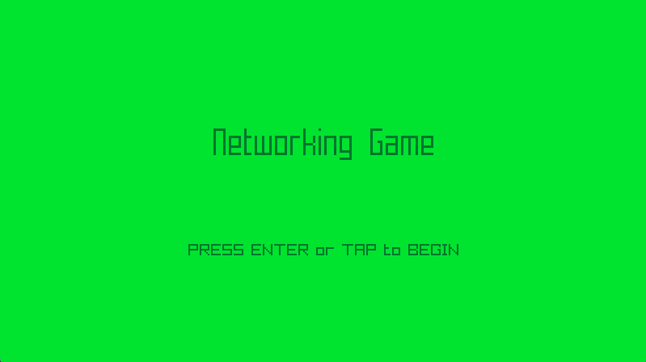

## Networking Game with Raylib

Welcome to **Networking Game with Raylib**!

This project is a multiplayer game built using the Raylib library and ENet for networking. The game features multiple screens, including an intro screen, a networking screen for connecting to a server, and a gameplay screen. This README provides an overview of the game, its features, and how to set it up.

## Installing CMake

### Windows

1. Download the CMake installer from the official website: [CMake Download](https://cmake.org/download/)
2. Run the installer and follow the instructions.
3. During the installation, make sure to select the option to add CMake to the system PATH for all users or the current user.

### Linux

#### Ubuntu/Debian

```sh
sudo apt update
sudo apt install cmake
```

#### Fedora

```sh
sudo dnf install cmake
```

#### Arch Linux

```sh
sudo pacman -S cmake
```

### macOS

1. Install Homebrew if you haven't already: [Homebrew](https://brew.sh/)
2. Use Homebrew to install CMake:

```sh
brew install cmake
```

## Getting Started

You can set up this project using CMake. The repository comes with CMake setup pre-configured.

### CMake

- Extract the zip of this project
- Run the following command:

```sh
cmake -S . -B build
```

> To include debug symbols, add the flag `-DCMAKE_BUILD_TYPE=Debug`

- Build the project:

```sh
cmake --build build
```

- The build folder will contain another folder (named after the project) with the executable and resources folder.

## Networking Game with Raylib



### Description

This is a multiplayer game built using Raylib for graphics and ENet for networking. The game includes an intro screen, a networking screen where players connect to a server, and a gameplay screen where the actual game is played. The networking screen handles the connection setup, and the connecting screen displays the connection status and transitions to the gameplay screen upon successful connection.

### Features

 - Multiplayer support with ENet
 - Seamless screen transitions
 - Interactive intro screen
 - Countdown to game start after connection

### Controls

Keyboard:
 - Enter: Start game / Connect to server
 - ESC: Exit game

### Screenshots

_TODO: Show your game to the world, animated GIFs recommended!._

### Developers

 - [Your Name] - Game Development, Networking Integration

### Links

 - YouTube Gameplay: _TODO_
 - itch.io Release: _TODO_
 - Steam Release: _TODO_

### License

This game is licensed under an unmodified zlib/libpng license, which is an OSI-certified, BSD-like license that allows static linking with closed source software. Check [LICENSE](LICENSE) for further details.

*Copyright (c) 2024 [Your Name]*
